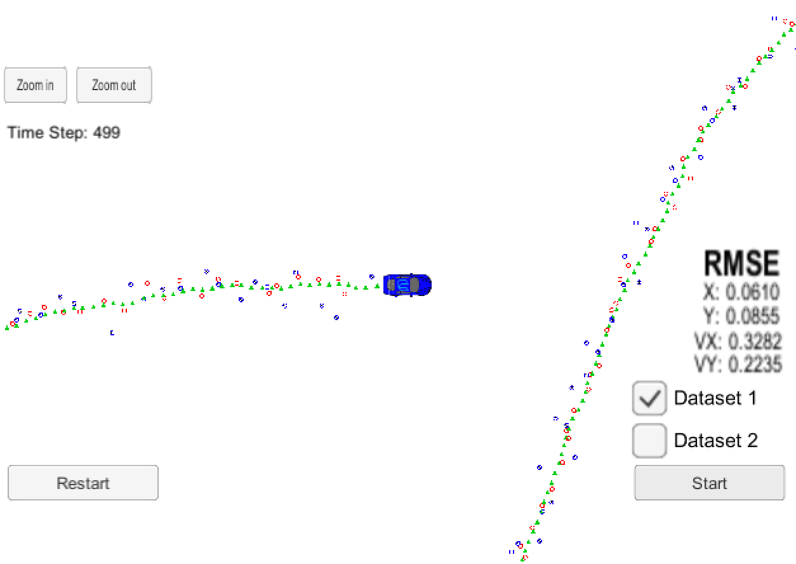
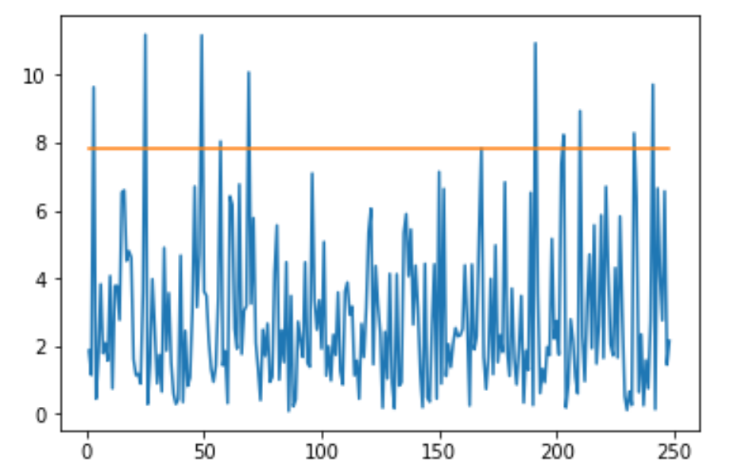
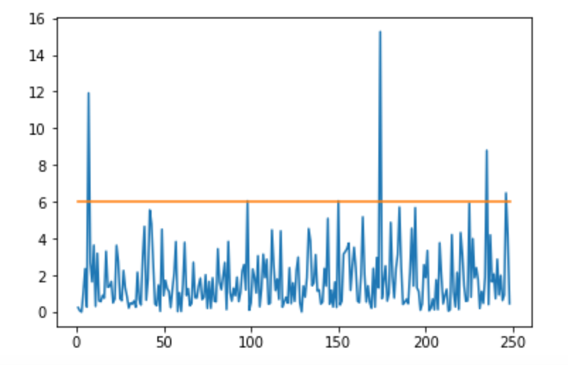

# Unscented Kalman Filter Project 

This is project 2 of term 2 of the Udacity Self-Driving Car Engineer Nanodegree Program.  The goal of this project is to use an unscented Kalman Fiter to estimate the state of a car given noisy lidar and radar measurements.   Udacity provides a simulator to test the code.

Starter code for this project is given [here](https://github.com/udacity/CarND-Unscented-Kalman-Filter-Project).

Here is a screenshot of my program at the end of the simulation.  

The final RMSE values are 0.0610 in the computation of the x-position, 0.0855 for the y-position, 0.3282 for the x-velocity, and 0.2235 for the y-velocity.

By the nature of the Kalman Filter, we also have estimates of how confident the algorithm is of each estimate.  We can see how these confidence estimates agree with reality by looking at the normalized innovation squared (NIS).  Here is a plot of the NIS radar measurements together with the 5% chi-squared line (about 5% of the values should lie above this line).

About 11 of the 250 measurements lie above the line, which is about 4.4% so very close to what we expect.

Here is the plot of NIS for the lidar measurements.

Here only about 7 of the 250 measurements lie above the 5% chi-squared line.  We also have a highly innovative reading around measurement 175.

## Compiling the code
The code can be run by executing

mkdir build

cd build

cmake .. && make

./UnscentedKF

